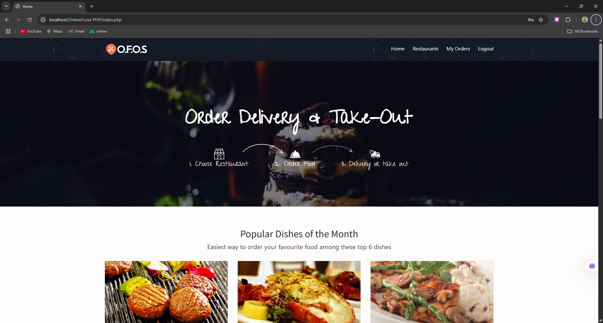
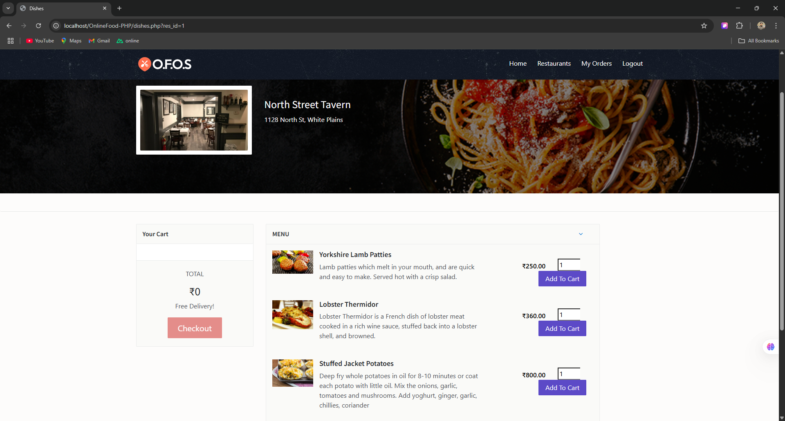
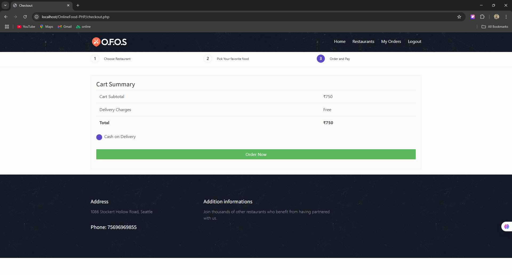

# 🍔 Online Food Ordering System

A web-based application that allows users to browse restaurants, add food items to the cart, and place online orders with ease.  
Built using **HTML, CSS, JavaScript, PHP, and MySQL**.

---

## 📸 Screenshots





---

## 🚀 Features

- User-friendly food browsing interface
- Add, remove, and update cart items
- User authentication (login & signup)
- Secure order placement
- Responsive design for mobile & desktop

---

## 🛠️ Technologies Used

- **Frontend:** HTML, CSS, JavaScript, Bootstrap
- **Backend:** PHP
- **Database:** MySQL
- **Version Control:** Git & GitHub

---

## 📥 Installation Steps

1. **Clone the repository**
    ```bash
    git clone https://github.com/yourusername/online-food-ordering-system.git
    ```

2. **Move into the project folder**
    ```bash
    cd online-food-ordering-system
    ```

3. **Set up the database**
    - Import the `database.sql` file into your MySQL database.
    - Update database credentials in `config.php`.

4. **Run the project**
    - Place the project folder inside your `htdocs` (XAMPP) or `www` (WAMP) directory.
    - Start Apache & MySQL.
    - Visit `http://localhost/online-food-ordering-system` in your browser.

---

## 📄 License

This project is licensed under the **MIT License** – see the [LICENSE](LICENSE) file for details.

---

## 👨‍💻 Author

**Anil Joiya**  
📧 Email: aniljoya23.com  
🌐 GitHub: [aniljoiya](https://github.com/aniljoiya)

